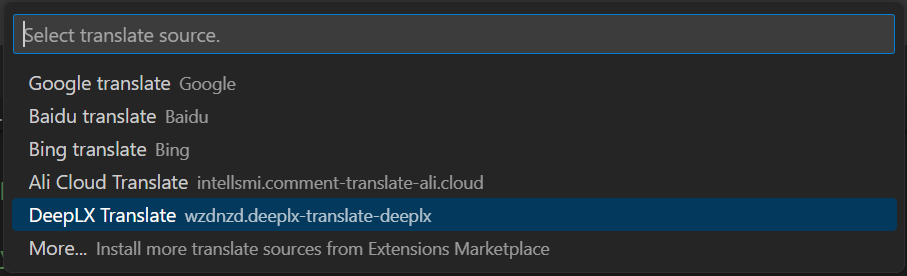

# deeplx-translate README

The plugin provides a translation source for the ‘comment-translate’ plugin. Itself does not activate, it starts when enabled is selected.

## Features

1. Provide translation capabilities
2. Provides online document link text

## Requirements

Please install [comment-translate](https://github.com/intellism/vscode-comment-translate) to use

## Install
1. Download the plugin from the [Release Page](https://github.com/wzdnzd/deeplx-translate/releases)
2. Install from VSIX: `Extensions` -> `...` -> `Install from VSIX...`
3. Select the downloaded file and install it

## Use
1. After installation, call the "Change translation source" command of "Comment Translate"
    
2. Check "DeepLX Translate" to configure the plugin API (and token if required)
    
3. Directly use the "Comment Translate" interactive mode to translate the corresponding text

## Public DeepLX API
+ `https://api.deeplx.org/translate`
+ `https://deeplx.aivvm.com/translate`

## Extension Settings

This extension contributes the following settings:

* `deeplxTranslate.apiPath`: DeepLX translation service API
* `deeplxTranslate.accessToken`: The token used during translation (if required by the translation service)
* `deeplxTranslate.ignorePattern`: Ignore regular expressions

## Known Issues

Calling out known issues can help limit users opening duplicate issues against your extension.

## Release Notes

Users appreciate release notes as you update your extension.

### 0.0.1

Initialize the project, the basic capabilities are implemented

### Build
+ Install vsce: `npm install -g vsce`
+ Package: `vsce package`